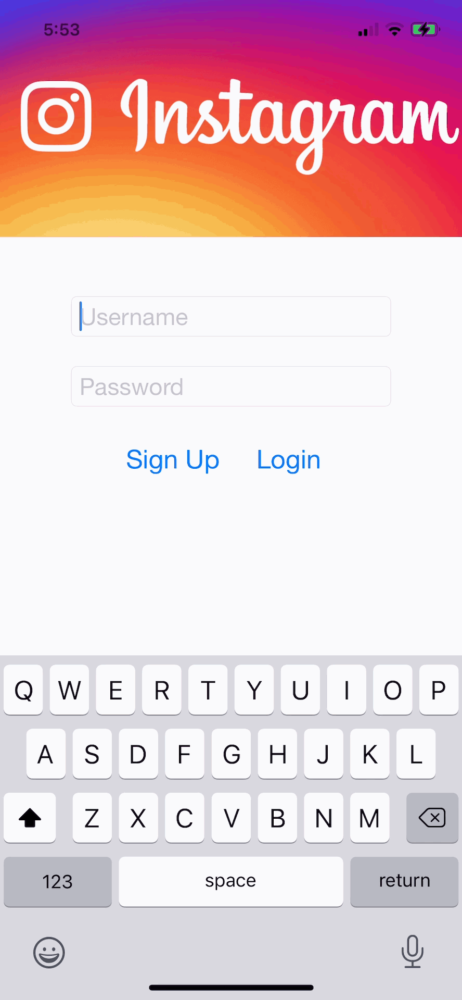

# Project 4 - *Instagram*

**Instagram** is a photo sharing app using Parse as its backend.

Time spent: **18** hours spent in total

## User Stories

The following **required** functionality is completed:

- [X] User can sign up to create a new account using Parse authentication
- [X] User can log in and log out of his or her account
- [X] The current signed in user is persisted across app restarts
- [X] User can take a photo, add a caption, and post it to "Instagram"
- [X] User can view the last 20 posts submitted to "Instagram"
- [X] User can pull to refresh the last 20 posts submitted to "Instagram"
- [X] User can tap a post to view post details, including timestamp and caption.

The following **optional** features are implemented:

- [X] Run your app on your phone and use the camera to take the photo
- [ ] User can load more posts once he or she reaches the bottom of the feed using infinite scrolling.
- [X] Show the username and creation time for each post
- [X] User can use a Tab Bar to switch between a Home Feed tab (all posts) and a Profile tab (only posts published by the current user)
- User Profiles:
  - [X] Allow the logged in user to add a profile photo
  - [X] Display the profile photo with each post
  - [X] Tapping on a post's username or profile photo goes to that user's profile page
- [X] After the user submits a new post, show a progress HUD while the post is being uploaded to Parse
- [ ] User can comment on a post and see all comments for each post in the post details screen.
- [ ] User can like a post and see number of likes for each post in the post details screen.
- [ ] Style the login page to look like the real Instagram login page.
- [ ] Style the feed to look like the real Instagram feed.
- [ ] Implement a custom camera view.

The following **additional** features are implemented:

- [X] User sees error message if they attempt to leave the creation page without posting
- [X] User sees new post on timeline immediately 
- [X] User can see different sized headers on profile page depending on bio length
- [X] User sees blurred image in the details page
- [X] User sees the number of post a user has made in the profile page

## Video Walkthrough

Here's a walkthrough of implemented user stories:

Update user information and post a picture

Signed in user is persisted across app restarts

Pull to refresh and register user

GIF created with [Kap](https://getkap.co/).

## Credits

List an 3rd party libraries, icons, graphics, or other assets you used in your app.

- [AFNetworking](https://github.com/AFNetworking/AFNetworking) - networking task library
- [Parse](https://parseplatform.org/) - service that allows app developers to add backend to apps
- [DateTools](https://github.com/MatthewYork/DateTools) - date formatting library
- [UITextView+Placeholder](https://github.com/devxoul/UITextView-Placeholder) - text view formatting library

## Notes

Challenges while developing this app included:

- Creating a collection view with a header
- Allowing the header to change sizes depending on the content
- Identifying which user information to send to the profile page when tapping on profile images
- Showing updates to profile picture and bio after it is updated in the settings page

## License

    Copyright [yyyy] [name of copyright owner]

    Licensed under the Apache License, Version 2.0 (the "License");
    you may not use this file except in compliance with the License.
    You may obtain a copy of the License at

        http://www.apache.org/licenses/LICENSE-2.0

    Unless required by applicable law or agreed to in writing, software
    distributed under the License is distributed on an "AS IS" BASIS,
    WITHOUT WARRANTIES OR CONDITIONS OF ANY KIND, either express or implied.
    See the License for the specific language governing permissions and
    limitations under the License.
